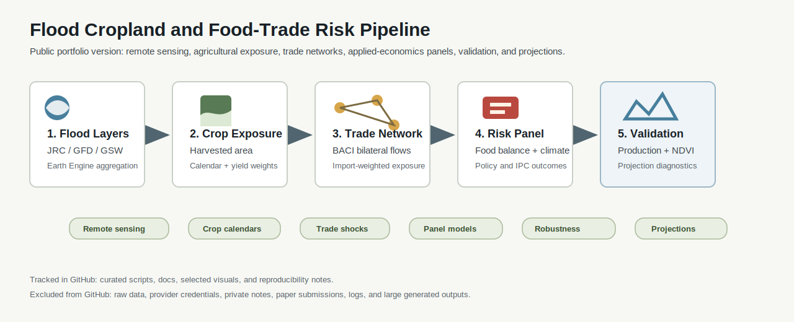
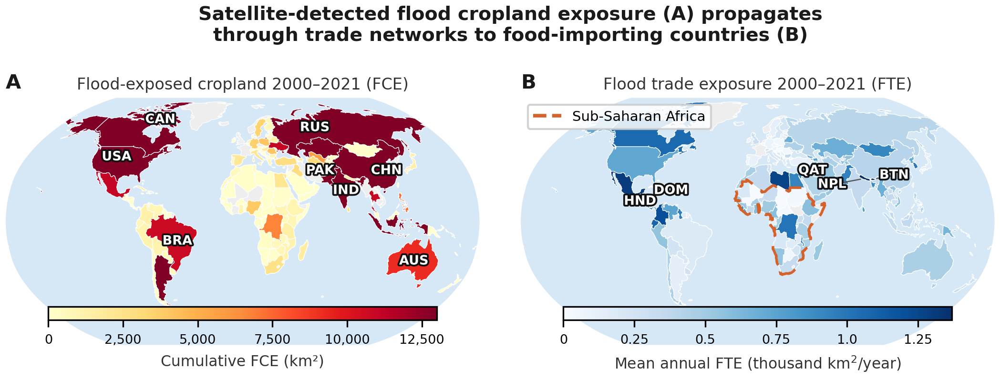
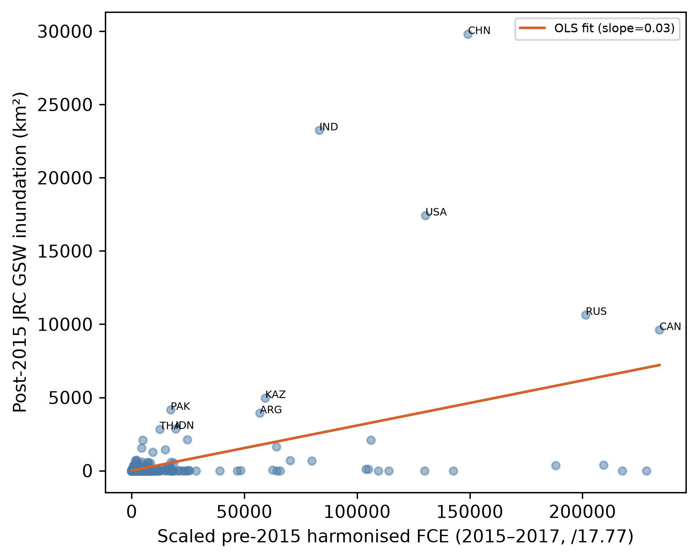

# Flood Cropland and Food-Trade Risk

Satellite flood exposure, crop calendars, and trade networks for food-security risk analysis.

This repository is a public portfolio release of a research pipeline that links flood exposure in crop-producing regions to downstream food-import risk. It is designed for agricultural economics, remote sensing, and climate-risk applications where local production shocks may propagate through commodity trade networks.

## What This Demonstrates

This project is meant to show research-computing ability in a policy-relevant agricultural monitoring setting:

- Google Earth Engine and satellite flood products;
- crop-calendar and harvested-area exposure construction;
- country-crop-year panel data engineering;
- BACI bilateral trade network processing;
- food-security, climate, policy, and validation data integration;
- reproducible R/Python-style project organization and Git workflow.

## Workflow



| Stage | Data product | Main scripts |
|---|---|---|
| 1. Satellite flood exposure | Flood cropland exposure by country, crop, and year | `scripts/phase1_flood/` |
| 2. Trade propagation | Import-weighted flood trade exposure | `scripts/phase2_trade/` |
| 3. Outcome panel | Food-balance, climate, policy, and exposure panel | `scripts/phase3_outcome/`, `scripts/phase3_panel/` |
| 4. Validation | Production, vegetation, and food-security checks | `scripts/phase4_validation/`, `scripts/phase4_ipc/` |
| 5. Projection inputs | Forward-looking caloric-risk exposure workflow | `scripts/phase5_projection/`, `scripts/phase5_projections/` |

## Selected Visuals

The public release includes a small set of selected visuals to show scale and workflow structure without releasing raw data or full manuscript outputs.





See `docs/VISUAL_GALLERY.md` for figure notes and what each public visual is intended to demonstrate.

## Example Data Products

The repository includes small real-data extracts in `examples/`. These are limited documentation samples, not a full replication dataset or final empirical result tables.

| Example file | Purpose |
|---|---|
| `examples/sample_flood_cropland_exposure.csv` | Exporter-crop-year flood cropland exposure extract |
| `examples/sample_flood_trade_exposure.csv` | Importer-crop-year trade exposure extract |
| `examples/sample_regression_panel_schema.csv` | Selected country-year fields for applied-economics analysis |

See `docs/SAMPLE_TABLES.md` for a readable version.

## Repository Structure

```text
scripts/
  phase1_flood/          Flood, crop-calendar, harvested-area, and yield-anomaly processing
  phase2_trade/          BACI trade ingestion and flood-trade exposure construction
  phase3_outcome/        FAO, ENSO, ERA5, trade-policy, and food-security data pulls
  phase3_panel/          Regression-panel construction and empirical specifications
  phase4_validation/     External validation using production and vegetation indicators
  phase4_ipc/            Food-security validation workflow
  phase5_projection*/    Forward-looking exposure and caloric-risk projection scripts
  figures/               Figure-building scripts
docs/
  DATA_SOURCES.md        Data provenance and access notes
  GEE_WORKFLOW.md        Google Earth Engine workflow notes
  METHOD_OVERVIEW.md     High-level empirical and data-engineering design
  REPRODUCIBILITY.md     Environment and run-order notes
  SAMPLE_TABLES.md       Illustrative non-sensitive data-product tables
  VISUAL_GALLERY.md      Notes on selected public visuals
examples/
  Small illustrative CSV schemas
figures/selected/
  Selected public-facing maps and diagnostics
```

## Reproducibility

```bash
python -m venv .venv
source .venv/bin/activate
pip install -r requirements.txt
```

The public repository is not a turnkey replication package because the workflow depends on large or access-controlled data sources. Raw data, private credentials, logs, manuscript files, and full generated outputs are intentionally excluded.

See `docs/REPRODUCIBILITY.md` for the suggested run order and `docs/DATA_SOURCES.md` for data-access notes.

## Public-Release Scope

Included:

- curated source scripts;
- project documentation;
- selected public-facing visuals;
- illustrative sample table schemas;
- reproducibility and data-access notes.

Excluded:

- raw satellite, trade, climate, and food-security data;
- private API credentials and local paths;
- unpublished manuscript files and submission packages;
- full empirical result tables.
